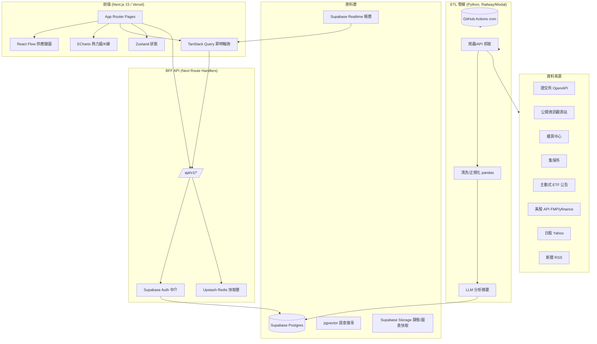

# AI 智慧產業地圖 — 技術架構計劃書

> 目標：打造超越 [aistockmap.com](https://aistockmap.com) 的互動式 AI 產業地圖產品。
> 作者：威柏（Weber） × 阿剛（Gang）
> 版本：v1.0 · 2026-07-13

---

## 0. 執行摘要（TL;DR）

aistockmap 本質是一個「內容型 + 定時快照」網站：Next.js 靜態/ISR 渲染、單人 AI 輔助整理、付費牆擋住深層資料。它的強項是**產業題材編輯品質**與**法人/ETF 資料齊全度**；弱點是**互動性弱（泳道圖非可探索節點圖）、即時性差、移動端體驗普通、AI 分析偏模板化**。

我們的超越路徑三條：
1. **互動式供應鏈圖**：從「好看的分類卡片」升級為可點擊、可展開下層、可高亮關聯、可鑽取到個股的節點圖。
2. **即時性 + 開放 API**：報價/法人用 Realtime/輪詢，未來開放資料 API 養開發者生態。
3. **LLM 驅動的真分析**：不是模板填空，而是「問這條供應鏈為什麼漲」「這檔個股風險點」的對話式分析。

---

## 1. aistockmap 功能拆解（對標基線）

| 模組 | 具體內容 | 我們的對標策略 |
|---|---|---|
| 題材總覽 / 產業地圖 | IC 設計（ASIC/IP、HPC 網通、類比功率）、每題材有公司數+描述+核實日期 | 升級為**可互動節點圖**（React Flow），點題材展開公司、點公司看供應鏈上下遊 |
| 今日產業漲幅焦點 | 產業類別 + 漲跌幅 + 家數 | 保留 + 加**熱力圖 treemap** 視覺 |
| 市場切換 | 台股 / 美股 / 日股 / 產業鏈 / ETF | 同，router 層預載 |
| 每日焦點 | 產業新聞（中央社/經濟日報/鉅亨/科技新報）、股癌 EP、游庭皓 | 加 **LLM 摘要 + 與供應鏈自動關聯標籤** |
| 三大法人買賣超 | 外資/投信/自營商 買進/賣出/買賣超 | 同，加圖表趨勢副圖 |
| 資券變化 | 融資/融券餘額 | 同 |
| 本週強勢股排行 | 個股+題材標籤+漲幅 | 同，加篩選 |
| 大戶加碼股 | 400張以上持股變動（集保週資料） | 同，加門檻滑桿 |
| 主動式 ETF 追蹤 | 每日持股變動（新增/加碼/減碼/移出） | 同 + 跨 ETF 聚合已做，我們加**訊號提醒** |
| 重大資訊觀測站 | MOPS 公告 | 同 + LLM 風險分類 |
| 市場熱力圖 | 付費解鎖 | 我們用 ECharts treemap 做免費基礎版 |
| 個股頁 | /c/2481/，tab=visuals、本益比河流圖、法人副圖、大戶持股、布林通道、財務分析 tab、EPS/營收標籤 | 全做 + 加 **LLM 問答** |
| 泳道圖 | 公司卡片顯示即時股價與漲跌幅 | 升級為節點圖卡片 |
| 登入 / 付費牆 | PAYUNi 統一金流 | Stripe + 綠界/PAYUNi |
| AI 分析排行榜 | 收藏、排序 | 加對話式分析 |

**更新排程（對標其 SLA）**：
- 產業焦點 每日 12:00
- 三大法人 平日 17:00
- ETF 持股 每日 16:00 / 17:55 / 20:30
- 重大資訊 每日 19:00
- 集保大戶 每週六 09:00

---

## 2. 系統總覽架構圖



---

## 3. 技術棧選擇與權衡

### 3.1 推薦最終組合（務實輕量）

| 層 | 技術 | 理由 |
|---|---|---|
| 前端框架 | **Next.js 15 (App Router) + React 19 + TS** | ISR/SSR 兼顧 SEO 與即時；與 aistockmap 同生態但用最新版 |
| 樣式 | **Tailwind CSS v4 + shadcn/ui** | 快速、一致、可維護 |
| 供應鏈圖 | **React Flow** | 可控、客製美觀、手機 pan/zoom；中等規模（<2000 節點）流暢 |
| 財經圖表 | **ECharts**（熱力圖/treemap/K線/河流圖）+ 可選 **Lightweight Charts** | ECharts 一統圖表需求，熱力圖用 treemap 極強 |
| 狀態 | **Zustand** | 比 Redux 輕，夠用 |
| 資料請求 | **TanStack Query** | 輪詢/快取即時報價、避免重渲染 |
| BFF | **Next Route Handlers** | 同倉庫，省一層部署 |
| 資料庫 | **Supabase Postgres** | 含 Auth/RLS/Realtime/Storage/Vector；初期免費額度夠 |
| 快取 | **Upstash Redis**（serverless） | 報價快取、rate limit；按用量計費 |
| Auth | **Supabase Auth** | Email/OAuth 現成 |
| 付費 | **Stripe**（國際）+ **綠界 ECPay / PAYUNi**（台灣） | 雙軌覆蓋 |
| ETL | **Python 3.12 + httpx + pandas + SQLAlchemy** | 爬蟲/清洗生態成熟 |
| LLM | **Claude (Anthropic) / GPT-4o** | 新聞摘要、個股分析、問答 |
| 部署 | **Vercel**（前端+API）+ **Supabase**（DB）+ **Railway/Fly.io/Modal**（ETL） | 全託管、免运维 |
| 監控 | **Sentry + UptimeRobot** | 錯誤與可用性 |

### 3.2 為什麼不用 X

- **不用 Cloudflare D1**：SQLite 不適合金融多表 Join + 視窗函數（法人移動平均、大戶變動）。
- **不用獨立後端（NestJS 等）**：初期過度工程；Route Handlers + 獨立 ETL 服務已分層清晰。
- **不用 GraphQL**：REST + TanStack Query 對此場景更直覺、省學習成本。
- **Cytoscape 僅當節點 >2000 才考慮**：React Flow 足以應付主題鑽取式互動。

---

## 4. 前端架構

```
src/
  app/
    (marketing)/           首頁、定價、關於
    map/
      [market]/[theme]/    產業地圖頁（台/美/日）
    stock/
      [symbol]/            個股頁（visuals / financials / analysis）
    etf/                    主動式 ETF 追蹤
    focus/                  每日焦點、新聞
    login/ pricing/
    api/
      v1/
        themes/route.ts
        stocks/route.ts
        quote/route.ts
        institutional/route.ts
        etf-holdings/route.ts
  components/
    map/SupplyChainGraph.tsx   React Flow 封裝
    chart/Heatmap.tsx           ECharts treemap
    chart/KLine.tsx
    chart/PERiver.tsx
    stock/StockCard.tsx
    layout/
  lib/
    supabase/client.ts
    query/                      TanStack Query hooks
    store/                      Zustand
  styles/
```

**關鍵互動設計（超越點）**：
- React Flow 畫布：節點=公司，邊=供應關係；點節點 → 側欄公司卡（即時價+漲跌+所屬題材+上下游高亮）。
- 鑽取：點題材群組 → 展開該題材全部公司（虛擬化防卡頓）。
- 手機端：雙指縮放、單指平移、底部 sheet 顯示卡片。
- 熱力圖 treemap：產業區塊面積=市值/漲幅濃淡，點擊跳地圖。

---

## 5. 後端 / API 架構（BFF）

Route Handlers 職責：
- 認證中繼（Supabase Auth cookie → RLS）
- 快取層（Upstash；報價 15s TTL、法人日級 TTL）
- 權限（免費 vs Premium 欄位遮罩）

API 設計（REST）：
```
GET /api/v1/themes?market=tw&industry=ic_design
GET /api/v1/stocks/:symbol                  (基本資料+即時報價)
GET /api/v1/stocks/:symbol/financials        (Premium)
GET /api/v1/stocks/:symbol/institutional     (法人/大戶)
GET /api/v1/quote/live?symbols=2330,2317     (批量即時)
GET /api/v1/etf/holdings?date=2026-07-13
GET /api/v1/focus/daily                      (每日焦點+AI摘要)
POST /api/v1/ai/ask                          (LLM 問答, Premium)
```

---

## 6. 資料層架構（DB Schema 概要）

```sql
-- 市場與個股
market(id, code)                      -- tw/us/jp
stock(id, symbol, market_id, name, industry_id,
      market_cap, price, change_pct, updated_at)

-- 產業題材（編輯型，初期人工+AI輔助）
theme(id, market_id, slug, title, description,
      verified_at, company_count)
theme_stock(theme_id, stock_id)       -- 多對多

-- 供應鏈關係（圖的邊）
supply_edge(from_stock_id, to_stock_id, relation)  -- 上游/下游/競爭

-- 每日行情快照
stock_daily(stock_id, date, open, high, low, close,
            volume, change_pct)

-- 法人/資券
institutional(stock_id, date, foreign_net, invest_net,
              dealer_net, margin_balance, short_balance)
major_holder(stock_id, week, hold_pct, change_shares)  -- 集保大戶

-- 主動式 ETF 持股變動
etf(id, code, name)
etf_holding(etf_id, stock_id, date, action)  -- add/increase/decrease/remove

-- 新聞/焦點
news(id, source, title, url, published_at, summary, theme_tags)
mops_announcement(stock_id, date, type, title)

-- AI 分析
ai_analysis(stock_id, theme_id, content, model, created_at)
ai_embedding(stock_id, embedding vector(1536))  -- pgvector 語意搜尋

-- 用戶/訂閱
profiles(id, email, plan, subscribed_until)
```

索引：stock(symbol, market_id)、(theme_id)、(date) 視窗查詢；pgvector 做相似個股/題材推薦。

---

## 7. 資料來源與 ETL 管線

### 7.1 來源清單

| 資料 | 來源 | 頻率 | 備註 |
|---|---|---|---|
| 台股即時/日線 | 證交所 OpenAPI `openapi.twse.com.tw` | 盤中/日 | 公開、需處理 CORS（走 ETL） |
| 法人買賣超 | 證交所 `BSI` 接口 | 日 17:00 | |
| 資券 | 證交所信用交易 | 日 | |
| 財報 | 公開資訊觀測站 MOPS | 季/年 | 有 API |
| 重大公告 | MOPS 即時公告 | 日 19:00 | |
| 集保大戶 | 台灣集中保管結算所 | 週六 09:00 | 公開資料 |
| ETF 持股 | 各投信公開月/日報 | 日 | 主動式 ETF 每日公告 |
| 美股 | Financial Modeling Prep / Alpha Vantage / yfinance | 日 | FMP 有免費層 |
| 日股 | Yahoo Finance JP / Nikkei | 日 | |
| 新聞 | 中央社/經濟日報/鉅亨 RSS + 爬蟲 | 日 12:00 | |

### 7.2 ETL 流程

```
GitHub Actions (cron) / Modal schedule
  → 觸發 Python worker
  → httpx 抓取多源（並發、重試、退避）
  → pandas 清洗/對齊/去重
  → LLM 生成新聞摘要 + 題材標籤 + 風險分類
  → SQLAlchemy upsert 到 Supabase Postgres
  → 觸發 Realtime 更新前端（若有訂閱）
```

**LLM 用法**（控制成本）：僅對「每日焦點新聞」做摘要、對「個股分析 tab」按需生成（Premium 觸發）、對題材描述做初稿輔助。用快取避免重算。

---

## 8. 即時資料策略

- **報價**：證交所 WebSocket（若有）或 ETL 每 15–30s 抓一次寫入 Supabase + Realtime broadcast；前端 TanStack Query 訂閱。
- **法人/ETF**：日級，ETL 完成即推送；前端輪詢 5min。
- **Rate limit**：Upstash 限制匿名 60 req/min，Premium 600 req/min。

---

## 9. AI 分析模組（差異化核心）

1. **新聞摘要**：每則新聞 → 100 字摘要 + 自動關聯題材/個股標籤。
2. **個股分析頁（Premium）**：LLM 綜合財報+法人+新聞+技術面，產出多空論點 + 風險提示（附引用來源）。
3. **對話式問答**：「這條供應鏈為什麼今天漲？」「2330 風險點？」→ RAG 檢索 DB + 新聞，LLM 回答。
4. **語意搜尋**：pgvector 對個股/題材 embedding，做「 similar stock 」「相關題材」推薦。

成本控制：摘要批量跑（離峰）、分析頁快取 24h、問答限額。

---

## 10. 付費與權限（Auth + RLS）

- Supabase Auth：Email + Google/Line OAuth。
- 方案：Free / Premium（月費，參考對手「一個月一杯咖啡」定價，約 NT$99–199/月）。
- RLS 策略：公開表全讀；`financials`、`ai_analysis`、`major_holder` 細節、完整熱力圖 → `plan='premium'` 才回傳（API 層也做欄位遮罩雙保險）。
- 付款：Stripe Checkout（國際卡）+ 綠界 ECPay / PAYUNi（台灣本地信用卡/超商）。Webhook 更新 `profiles.subscribed_until`。

---

## 11. 部署架構

```
Vercel (Production)
  ├─ Next.js 前端 + Route Handlers
  ├─ 自動 Preview 部署（PR）
  └─ Edge 快取靜態

Supabase (Managed)
  ├─ Postgres + pgvector
  ├─ Auth / RLS
  ├─ Realtime
  └─ Storage

Railway / Fly.io / Modal
  └─ Python ETL worker（cron 喚醒）

Upstash Redis   → 快取/限流
Sentry          → 錯誤監控
UptimeRobot     → 可用性
```

成本（初期估算，月）：Vercel Hobby/Pro $0–20、Supabase Free/$25、Railway $5、Upstash $0–10、LLM $20–50、Supabase Storage 極低。 **初期可壓在 $30–100/月**。

---

## 12. 開發路線圖

### Phase 0 — MVP 骨架（2 週）
- [ ] Next.js + TS + Tailwind + shadcn 起專案
- [ ] Supabase 建表 + Auth
- [ ] React Flow 靜態假資料畫「AI 半導體供應鏈」示意圖
- [ ] 個股卡側欄 + 點擊互動
- [ ] 跑起 Vercel Preview

### Phase 1 — 資料管線（3 週）
- [ ] 證交所/櫃買 ETL：即時報價、日線、法人
- [ ] MOPS 財報 + 重大公告
- [ ] 集保大戶 + ETF 持股
- [ ] 題材表（人工+AI 輔助 20 個核心題材）

### Phase 2 — 視覺化與首頁（2 週）
- [ ] 熱力圖 treemap、強勢股排行、每日焦點
- [ ] 市場切換（台/美/日）
- [ ] 移動端優化

### Phase 3 — AI 與付費（3 週）
- [ ] 新聞 LLM 摘要 + 題材標籤
- [ ] 個股分析頁 + 對話問答（RAG）
- [ ] Stripe + 綠界 付費牆 + RLS

### Phase 4 — 增長（持續）
- [ ] 開放資料 API（養生態）
- [ ] 個股提醒/ETF 訊號通知
- [ ] SEO + 內容行銷

---

## 13. 風險與合規

- **資料授權**：證交所/MOPS 公開資料可用於非直接轉售；注意「證交所行情」有使用規範，商業化前確認授權（可改用 Fugle/SinoPac 等合規行情源）。
- **金融警示**：網站須加「非投資建議」免責聲明。
- **LLM 幻覺**：AI 分析須附引用來源、標註「AI 生成」，避免誤導。
- **爬蟲禮貌**：加延遲/User-Agent/robots 遵守，避免被封。

---

## 14. 下一步執行清單（威柏立即可動）

1. 確認市場優先級（建議：**台股先行**，美股/日股 Phase 2+）。
2. 建立 `aistockmap-project/` repo，初始化 Next.js + Supabase。
3. 用假資料實作 React Flow 供應鏈示意圖（AI 半導體），驗證核心互動。
4. 評估行情資料合規來源（證交所 OpenAPI vs Fugle）。
5. 決定定價與付費通道（Stripe + 綠界）。

---
*本計劃書為 v1.0 架構草案，將隨開發迭代更新。*
